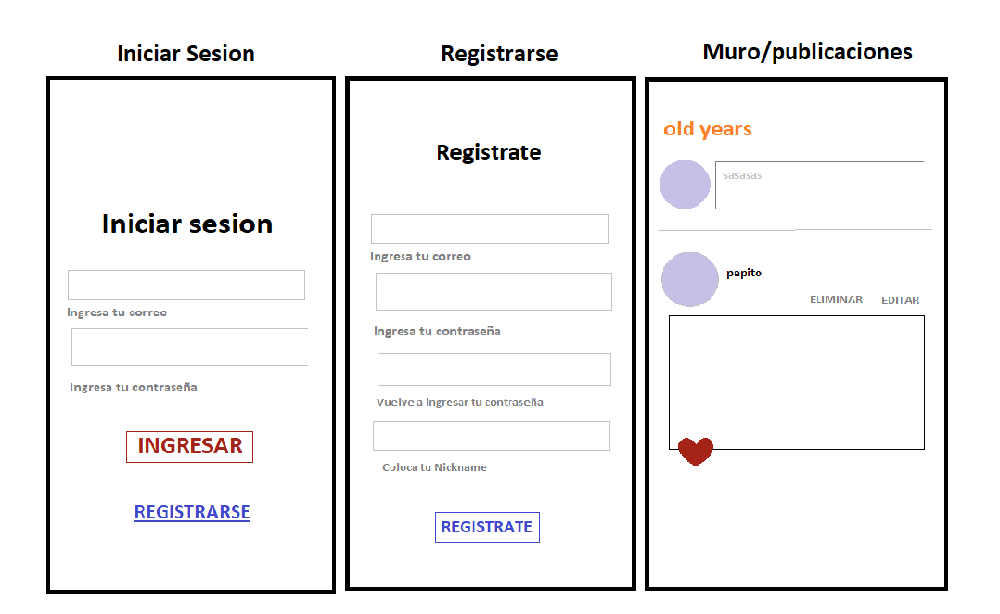

RED SOCIAL 
(SENIOR FACE)
-------------------------------------------------------------------------------------------------------------------------------------
Índice
1. Senir-Face
2. Prototipos
3. Historias de Usuario
4. Deploy
5. Test de usabilidad
 
-------------------------------------------------------------------------------------------------------------------------------------

## 1. Senior Face
Senior Face es una red social diseñada para personas mayores que busca combatir la exclusión y la sensación de abandono en este grupo de la sociedad. Proporciona un espacio digital donde los usuarios pueden interactuar, compartir experiencias y establecer conexiones virtuales.

En Senior Face, los usuarios pueden realizar diversas acciones, como dar "me gusta" a las publicaciones de otros usuarios, eliminar sus propios comentarios y editar sus propias publicaciones. También tienen la capacidad de compartir contenido con la comunidad de Senior Face. Los usuarios pueden acceder a la plataforma iniciando sesión con su cuenta de Google o creando un nuevo usuario.

Para almacenar y gestionar la información de los usuarios, Senior Face utiliza la base de datos de Firebase. Firebase es una plataforma robusta para el desarrollo de aplicaciones móviles y web que proporciona un almacenamiento seguro y escalable de datos. Esto garantiza una experiencia fluida y confiable, con una rápida recuperación de información.

## 2. Prototipos
### 2.1. Prototipo baja fidelidad
Movil 

Desktop

### 2.2. Prototipo alta fidelidad (FIGMA)
Movil y Desktop

## 3. Historias de Usuario
Para iniciar con el desarrollo de la página web, se realizó una encuesta a un grupo de posibles usuarios con la finalidad de conocer sus preferencias o expectativas. Para ello se les pidió que completaran el siguiente formulario. A partir de ella y teniendo en cuenta los principales requerimientos del proyecto, creamos las siguientes historias de usuario.

### 3.1. Historia de usuario: Publicar una experiencia de vida
Como usuario de Senior Face, quiero poder compartir mis experiencias de vida con otros miembros de la comunidad. Quiero redactar un nuevo post, adjuntar fotos relevantes y publicarlo para que otros usuarios puedan leerlo y comentar.

### 3.2. Historia de usuario: Eliminar un post no deseado
Como usuario de Senior Face, a veces puedo cometer errores al publicar o simplemente cambiar de opinión sobre un post. Quiero tener la opción de eliminar un post que considero innecesario o que ya no quiero que esté visible en la red social. Al eliminar el post, desaparecerá de mi perfil y de la vista de otros usuarios.

### 3.3. Historia de usuario: Editar un post existente
Como usuario de Senior Face, puedo querer hacer modificaciones en un post que ya he publicado. Por ejemplo, puedo detectar errores ortográficos o agregar información adicional que haya olvidado mencionar. Quiero tener la capacidad de editar mis posts anteriores para mantener la precisión y calidad de mis publicaciones.

### 3.4. Historia de usuario: Dar "me gusta" a un post interesante
Como usuario de Senior Face, me gusta apreciar y mostrar mi interés por las publicaciones de otros miembros de la comunidad. Quiero tener la opción de dar "me gusta" a los posts que encuentro interesantes o con los que me identifico. Al dar "me gusta", quiero que el autor del post reciba una notificación y pueda ver la cantidad de apreciación que ha recibido.

## 4. Test de usabilidad
Se realizaron test de usabilidad para saber la opinión de los usuarios sobre la página, obteniendo los siguientes resultados:

### 4.1 Usuario 1 
Cambios realizados:

* Que la palabra "Registrar ahora" resalte cuando el puntero pase sobre ella
* Que el botón Guardar e Ingresar, así como los espacios para colocar el Correo Electrónico y la Contraseña generen alguna reacción cuando el puntero pase sobre ellos

### 4.2 Usuario 2 
Cambios realizados:

* Cuando le de guardar en el cuadro de publicar seria bueno que el cuadro se cerrara
* En el momento de eliminar un test, deberia de aparecer un mensaje para asegurarse de querer borrar la publicacion
* Cuando estaba editando y le di al boton guardar, como el cuadro seguia mostrandose pense que no habia guardado, seria bueno que cuando se de click se cierre ese cuadro.

### 4.3 Usuario 3 
Cambios realizados:

* Cuando se va a publicar por segunda vez, la informacion de la primera publicacion sigue en el cuadro
* Cuando se va a editar una publicacion y luego se guarda el cuadro sigue puesto y no se cierra

### 4.4 Usuario 4 
Cambios realizados:

* Corregir alineación de los iconos del logueo de las redes sociales
* Que los mensajes de error se muestren debajo de los casillas donde se ingresa el correo y la contraseña
* Agregar un botón de retorno a la página de login y registro hacia la página de bienvenida

Autoras

Carol Raquel

🧰 

👾 

Maria Toribio

🧰 https://www.linkedin.com/in/maria-toribio-rojas/

👾 https://github.com/MaryToribio?tab=repositories

